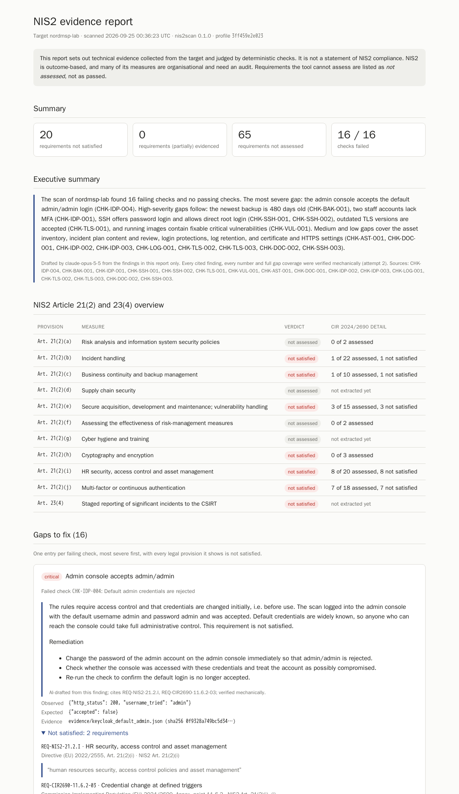

# Example reports

Real output from live scans of the demo lab on 2026-09-25. Nothing here is mocked.

| Folder | Lab profile | Result |
|---|---|---|
| [`weak/`](weak/) | deliberately misconfigured | 16/16 checks fail, 20 requirements not satisfied, AI narrative (Claude Opus 5.5) accepted on attempt 2 |
| [`hardened/`](hardened/) | gaps closed | 16/16 checks pass, 20 requirements partially evidenced, no gaps |

Open `weak/report.html` in a browser to see the full report. GitHub displays HTML files as
source code. Each folder also holds the scan's raw material: `findings.json`,
`verdicts.json`, `scan.json` (tool version, profile hash, evidence hashes), `evidence/`, and
for the weak scan `narrative.json` (the accepted narrative and its model and prompt
version).

**Narrative model:** the example uses Claude Opus 5.5. An earlier narrative of the same
scan by Claude Opus 5 also passed the validator, but it quoted raw field names
("retention_days 7") where managers need plain words. Opus 5.5 states the same facts in
plain language ([comparison](../../eval/results/2026-09-25-opus-5-5.md)).
