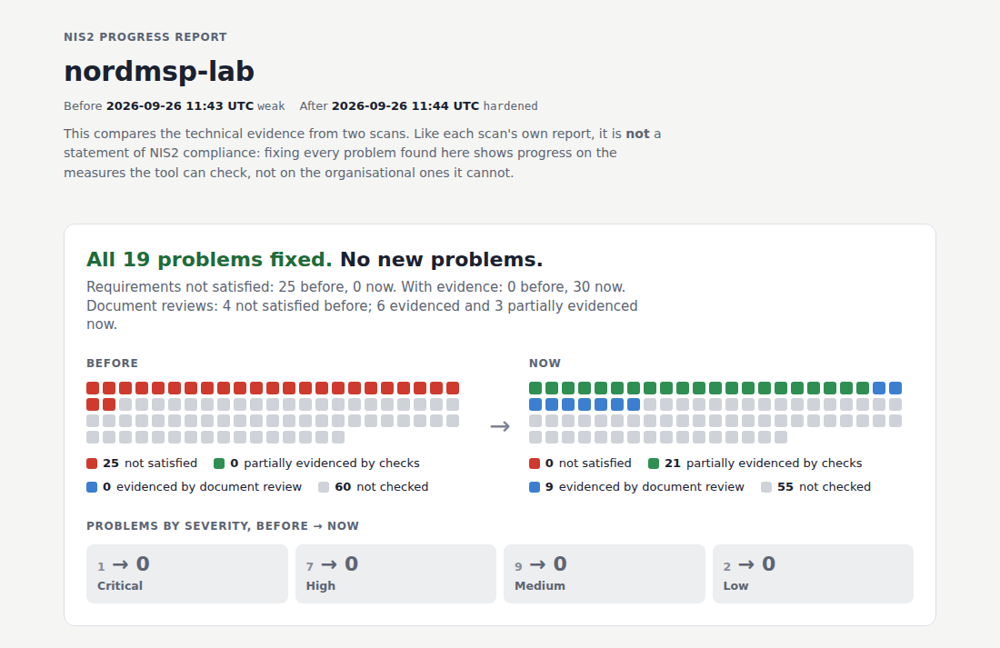

# Example reports

Real output from live scans of the demo lab on 2026-09-26. Nothing here is mocked.

The lab has nine systems: a web endpoint, an SSH host, Keycloak, two log stores (Loki and
Elasticsearch), two backup tools (restic and BorgBackup), a Docker project and the
organisation's documents. Some checks therefore run on more than one system, which gives 20
results for 17 checks. Each profile also has an evidence register: a (fictional) consultant's
reviews of the organisation's documents for requirements no check covers
([ADR 0007](../adr/0007-document-evidence.md)).

| Folder | Lab profile | Result |
|---|---|---|
| [`weak/`](weak/) | deliberately misconfigured | 17/17 checks fail; 25 requirements not satisfied, 21 by checks and 4 by document review; AI narrative (Claude Opus 5.5) accepted on attempt 2 |
| [`hardened/`](hardened/) | gaps closed | 17/17 checks pass on every system; 30 requirements with evidence, 21 partially evidenced by checks and 9 by document review (6 evidenced, 3 partially); no gaps |

[`weak-to-hardened.html`](weak-to-hardened.html) compares the two scans with
`nis2scan diff docs/example-report/weak docs/example-report/hardened`: all 19 problems fixed,
none new. There are 20 results, but one of them passes in both scans: the weak lab's restic
repository is already encrypted, because restic always encrypts. The comparison also shows
the document reviews: 4 requirements not satisfied before, 6 evidenced and 3 partially
evidenced after.

Open `weak/report.html` or `weak-to-hardened.html` in a browser to see the full pages.
GitHub displays HTML files as source code. Each folder also holds the scan's raw material:

- `findings.json` and `verdicts.json`;
- `scan.json`: the tool version, the profile hash, the engagement, the systems scanned with
  their detected products, the evidence register's summary, and the evidence hashes;
- `evidence/`: one file per collector and system, keeping each product's raw answer next to
  the normalised values; `evidence/evidence_register/` holds each review with the SHA-256
  of every document it rests on;
- for the weak scan, `narrative.json`: the accepted narrative with its model and prompt
  version.

**Narrative:** the weak report's narrative was written by Claude Opus 5.5 with prompt
`2026-09-25.2`. It explains the gaps that span several systems per system, with each
system's own values ([measurement](../../eval/results/2026-09-26-narrative-multi-asset.md)).
An earlier narrative by Claude Opus 5 also passed the validator, but it quoted raw field
names where managers need plain words
([comparison](../../eval/results/2026-09-25-opus-5-5.md)).
